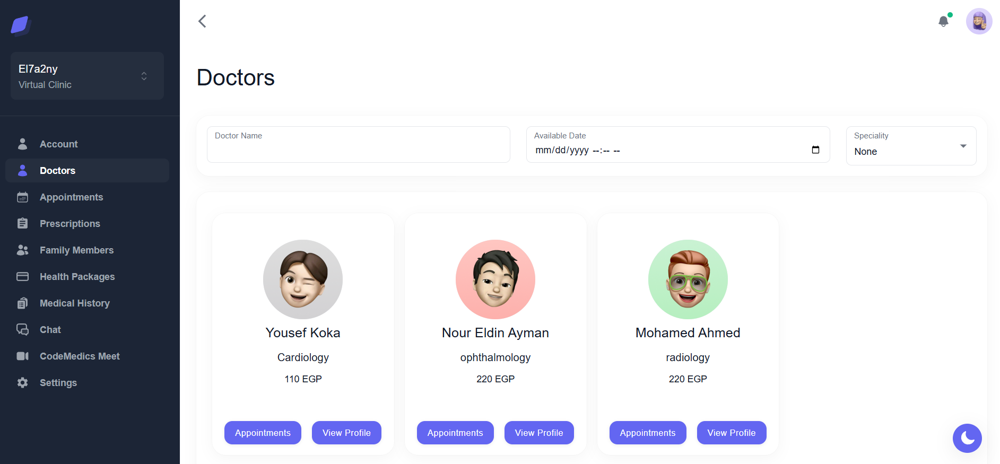
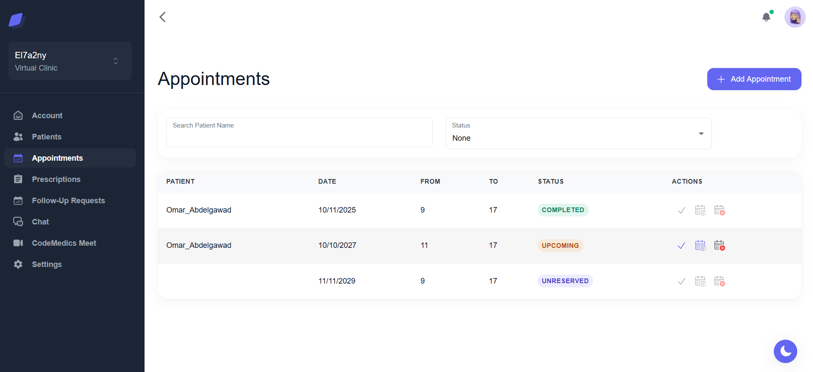
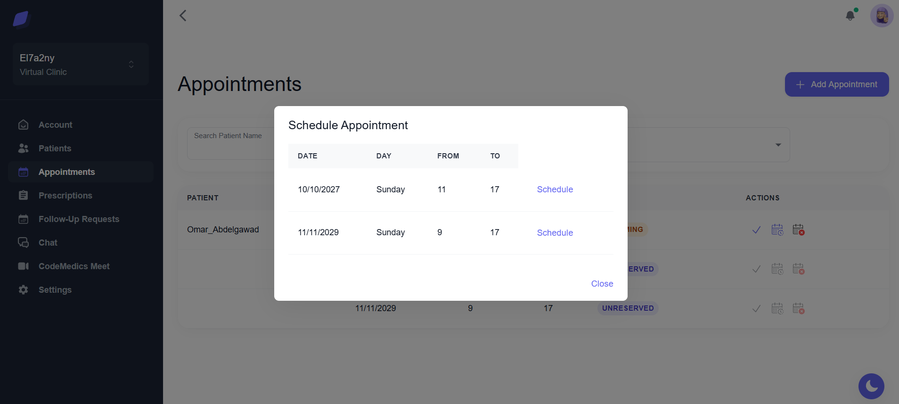
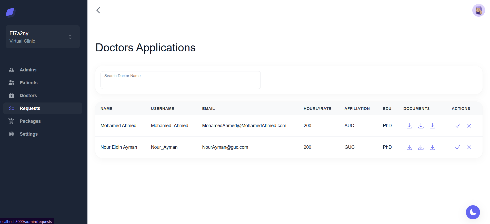
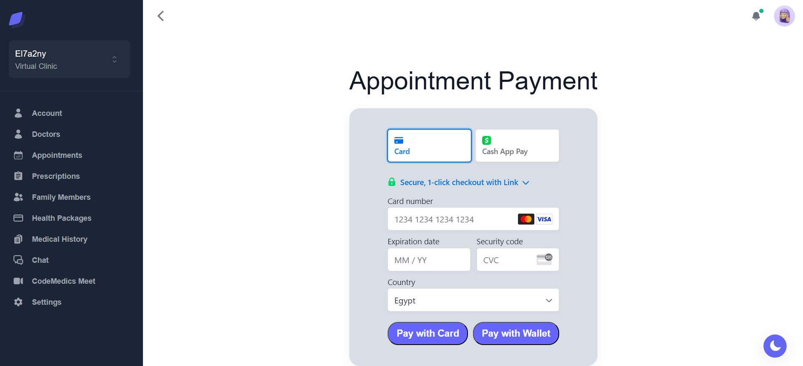
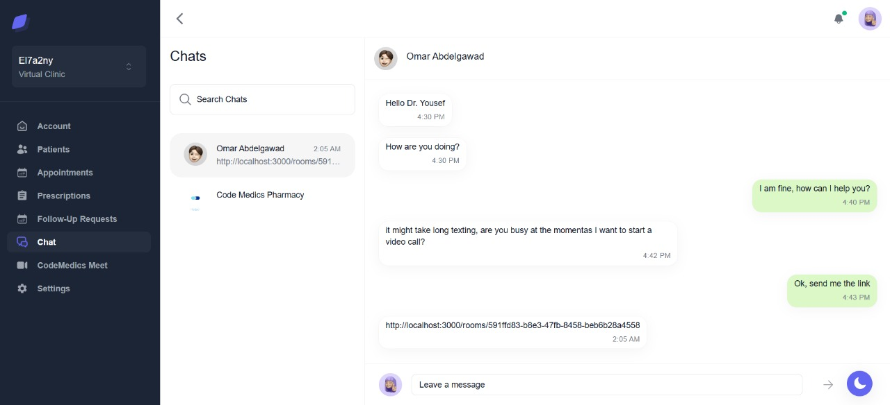

# El7a2ny Virtual Clinic and Pharmacy

El7a2ny Virtual Clinic and Pharmacy is not just a software solution; it's a revolutionary approach to healthcare. In a world where convenience and efficiency matter, our goal is to redefine the concept of "Telehealth" by leveraging cutting-edge technologies and techniques.

To ensure scalability, maintainability, and separation of concerns, the project was developed following the **Clean Architecture** pattern. This architectural approach allowed clear boundaries between business logic, presentation, and data layers, making the system robust and adaptable to future enhancements.

## Build Status

[](https://your-build-url)

The current version of El7a2ny Virtual Clinic and Pharmacy is successfully passing all builds. We are committed to delivering a robust and reliable platform. If you found any issues while using the system, you can just reach out to any one of the contributors with your issue.

## Planned Features

We are continuously working to enhance the El7a2ny Virtual Clinic and Pharmacy platform. Upcoming features and improvements include:

- **Swagger Integration**: API documentation using Swagger will be added very soon to provide an interactive and developer-friendly interface for exploring and testing the backend endpoints.

- **Redis Caching**: Integration of Redis is planned to optimize data retrieval, reduce server load, and improve overall response time through efficient caching mechanisms.

- **Testing with Jest**: Unit and integration tests will be implemented using Jest to ensure code reliability, catch regressions early, and improve development confidence.

- **Microservices Refactor**: The monolithic structure will be progressively refactored into a microservices architecture. This will improve scalability, isolate services for easier maintenance, and allow independent deployment of critical modules.

<details>
<summary><strong>Code Style Guide</strong></summary>

## JavaScript (Node.js and React)

- _Naming Conventions_: camelCase for variables/functions, PascalCase for React components.

## Express.js (Backend)

- _Routing_: Follow RESTful conventions for organized routes.
- _Middleware_: Use for route-specific logic.

## MongoDB (Database)

- _Naming Conventions_: Maintain consistent naming for collections (singular nouns).
- _Schema Design_: Ensure consistency across collections.

## React with Material-UI (Frontend)

- _MUI Components_: Leverage Material-UI components and adhere to their guidelines.
- _Folder Structure_: Organize components by features/functions.
- _State Management_: Use Context API for complex state (if needed).
- _Lifecycle Methods_: Prefer hooks and functional components.

## Git Workflow

- _Branching_: Follow Gitflow (feature branches, develop, master).
- _Pull Requests_

</details>

## Screenshots

<details>
<summary><strong>Patient Dashboard</strong></summary>



</details>

<details>
<summary><strong>Doctor's Appointments</strong></summary>



</details>

<details>
<summary><strong>Doctor Scheduling an Appointment</strong></summary>



</details>

<details>
<summary><strong>Doctors' Applications Page</strong></summary>



</details>

<details>
<summary><strong>Appointment Payment</strong></summary>



</details>

<details>
<summary><strong>CodeMedic's Meet</strong></summary>


</details>

<details>
<summary><strong>CodeMedic's Chat</strong></summary>



</details>

### Phamrmacy

<details>
<summary><strong>Pharmacy Section</strong></summary>


</details>

<details>
<summary><strong>Pharmacy Cart</strong></summary>


</details>

## Code Snippets

Backend Snippet

<details>
<summary> Patient Controller Snippet </summary>

```javascript
router.patch("/:username/password", async (req, res) => {
  try {
    const patient = await patientService.updatePatientPassword(
      req.params.username,
      req.body.password
    );
    res.status(200).json({ data: patient });
  } catch (error) {
    errorHandler(error, req, res);
  }
});

router.get("/:username/appointments", async (req, res) => {
  try {
    const appointments = await patientService.getPatientAppointments(
      req.params.username,
      req.query.status
    );
    res.status(200).json({ data: appointments });
  } catch (error) {
    errorHandler(error, req, res);
  }
});
```
</details>

### ----------------------------------------------

Frontend Snippets

<details>
<summary>Patient Account Page</summary>

```javascript
import { useState } from "react";
import { Box, Container, Stack, Typography } from "@mui/material";
import { Layout as DashboardLayout } from "src/layouts/dashboard/user/layout";
import Message from "src/components/Miscellaneous/Message";
import Title from "src/components/Table/Body/Title";
import LoadingSpinner from "src/components/LoadingSpinner";
import Account from "src/components/Account/Account";
import { BACKEND_ROUTE } from "src/utils/Constants";
import { useGet } from "src/hooks/custom-hooks";
import Cookies from "js-cookie";

const Page = () => {
  const [patient, setPatient] = useState({});
  const [showError, setShowError] = useState(false);
  const [error, setError] = useState("");
  const [loading, setLoading] = useState(true);

  const fields = [
    { name: "firstName", label: "First Name", type: "text" },
    { name: "lastName", label: "Last Name", type: "text" },
    { name: "email", label: "Email", type: "email" },
    { name: "number", label: "Phone Number", type: "text" },
    { name: "dateOfBirth", label: "Date Of Birth", type: "date" },
    { name: "emergencyContact.name", label: "Emergency Contact Name", type: "text" },
    { name: "emergencyContact.number", label: "Emergency Contact Number", type: "text" },
    { name: "emergencyContact.relation", label: "Emergency Contact Relation", type: "text" },
  ];

  useGet({
    url: `${BACKEND_ROUTE}/patients/${Cookies.get("username")}`,
    setData: setPatient,
    setLoading,
    setError,
    setShowError,
  });

  return (
    <>
      <Title title="My Account" />
      <Box component="main" sx={{ flexGrow: 1, py: 8 }}>
        <Container maxWidth="lg">
          <Stack spacing={3}>
            <div>
              <Typography variant="h4">Account</Typography>
            </div>
            <div>{loading ? <LoadingSpinner /> : <Account user={patient} fields={fields} />}</div>
          </Stack>
        </Container>
      </Box>
      <Message
        condition={showError}
        setCondition={setShowError}
        title={"Error"}
        message={error}
        buttonAction={"Close"}
      />
    </>
  );
};

Page.getLayout = (page) => <DashboardLayout>{page}</DashboardLayout>;
export default Page;
```
</details>

<details>
<summary>Doctor's Patients Page</summary>

```javascript
import { useState } from "react";
import { Layout as DashboardLayout } from "src/layouts/dashboard/doctor/layout";
import { useGet } from "src/hooks/custom-hooks";
import Cookies from "js-cookie";
import { BACKEND_ROUTE } from "src/utils/Constants";
import { Table } from "src/components/Table/Table";
import ObjectInfo from "src/components/ObjectInfo";
import { DoctorPatientActions } from "src/components/DoctorPatientActions";
import Message from "src/components/Miscellaneous/Message";

const columns = ["Name", "Email", "Date Of Birth", "Actions"];

const Page = () => {
  const [allData, setAllData] = useState([]);
  const [loading, setLoading] = useState(true);
  const [searchName, setSearchName] = useState("");
  const [upcoming, setUpcoming] = useState("None");
  const [showError, setShowError] = useState(false);
  const [error, setError] = useState("");
  const [popUpDisplay, setPopUpDisplay] = useState(false);
  const [popUpElement, setPopUpElement] = useState();

  const username = Cookies.get("username");

  const filters = [
    {
      type: "text",
      name: "Search Patient Name",
      state: searchName,
      setState: setSearchName,
    },
    {
      type: "menu",
      name: "Upcoming",
      state: upcoming,
      setState: setUpcoming,
      options: [
        { value: "None", label: "None" },
        { value: "Yes", label: "Yes" },
        { value: "No", label: "No" },
      ],
    },
  ];

  useGet({
    url: `${BACKEND_ROUTE}/doctors/${username}/patients`,
    setData: setAllData,
    setLoading,
    setError,
    setShowError,
  });

  const handleData = () => {
    return allData.filter((item) => {
      if (
        searchName !== "" &&
        !`${item.patient.firstName} ${item.patient.lastName}`
          .toLowerCase()
          .includes(searchName.toLowerCase())
      )
        return false;
      if (
        upcoming !== "None" &&
        ((upcoming == "Yes" && item.upcoming) || (upcoming == "No" && !item.upcoming))
      )
        return false;
      return true;
    });
  };

  const data = handleData();

  console.log("Data", data);

  const tableRows = data.map((item) => {
    console.log("item", item);
    return (
      <>
        <ObjectInfo obj={item.patient} attributes={["username", "email", "dateOfBirth"]} />
        <DoctorPatientActions patient={item.patient} />
      </>
    );
  });

  return (
    <>
      <Table
        value={{
          data,
          columns,
          loading,
          setShowError,
          setError,
          setLoading,
          noRecords: "No Patients Found",
          setAllData,
          tableRows,
          popUpDisplay,
          popUpElement,
          setPopUpDisplay,
          setPopUpElement,
        }}
        filters={filters}
        title="Patients"
      />
      <Message
        condition={showError}
        setCondition={setShowError}
        title="Error"
        message={error}
        action="Close"
      />
    </>
  );
};

Page.getLayout = (page) => <DashboardLayout>{page}</DashboardLayout>;

export default Page;
```
</details>

## Frameworks and Technologies Used
- [Node.js](https://nodejs.org/)
- [Express](https://expressjs.com/)
- [React](https://reactjs.org/)
- [MongoDB](https://www.mongodb.com/)
- [Mongoose](https://mongoosejs.com/)
- [Material-UI](https://mui.com/)
- [Stripe](https://stripe.com/)
- [Git](https://git-scm.com/)
- [MongoDB Atlas](https://www.mongodb.com/atlas)
- [Postman](https://www.postman.com/)
- [VSCode](https://code.visualstudio.com/)
- [Socket IO](https://socket.io/)
- [JWT](https://jwt.io/)
- [Node Mailer](https://nodemailer.com/)


## Features

### For Doctors:

- **Registration and Account Management:** Doctors can easily register and manage their accounts. Each doctor has their own wallet, allowing them to handle transactions seamlessly.

- **Hourly Rate Management:** Doctors can set their hourly rates and publish their available time slots for appointments.

### For Patients:

- **User Registration and Profile:** Patients can register, create profiles, and view details about different doctors and their specialties.

- **Appointment Booking:** Patients can book appointments with doctors based on their availability.

- **Chat and Video Calls:** After completing appointments, patients can engage in chat with doctors and make video calls for follow-up consultations.

- **Health Packages Subscription:** Patients can subscribe to health packages (Silver, Gold, Platinum) offering discounts based on the tier.

- **Family Members Management:** Patients can add family members to their accounts, extending subscription benefits to them.

- **Pharmacy Services:** Patients can purchase medicines from the pharmacy section, checkout, and track their orders. They can also engage in chat with the pharmacy.

- **Password Reset:** Patients can reset their passwords via email if forgotten.

### For Pharmacists:

- **Registration and Account Management:** Pharmacists can register, manage their accounts, and add medicines to the inventory.

- **Medicine Management:** Pharmacists can categorize medicines as over-the-counter (OTC) or prescription-only. Medicines can be archived or unarchived as needed.

### For Admins:

- **Account Approval:** Admins have the authority to approve new doctor and pharmacist accounts.

These features collectively make El7a2ny Virtual Clinic and Pharmacy a comprehensive platform for streamlined healthcare services, connecting doctors, patients, and pharmacists efficiently.

## Credits

- [NodeJs docs](https://nodejs.org/en/docs)
- [Express docs](https://expressjs.com/en/4x/api.html)
- [ReactJs docs](https://reactjs.org/docs/getting-started.html)
- [Mongoose docs](https://mongoosejs.com/docs/)
- [Stripe docs](https://stripe.com/docs)

### Other Contributions

- [Any Other Third-Party Libraries or Resources Used](#): Acknowledgment to the creators of any additional libraries or resources that have been utilized in the development of El7a2ny Virtual Clinic and Pharmacy.

We extend our appreciation to the developers, educators, and contributors whose work has played a key role in the success of this project.


## API Reference
Will be added very soon

## Installation

To get started with the El7a2ny Virtual Clinic and Pharmacy, follow the steps below:

### Clinic Installation

Clone the Clinic repository from GitHub:

 ```bash
 git clone https://github.com/advanced-computer-lab-2023/CodeMedics-Clinic
````

### Clinic Installation

Clone the Clinic repository from GitHub:

```bash
git clone https://github.com/advanced-computer-lab-2023/CodeMedics-Pharmacy
```

## How to Use

### Clinic

1. ```bash
   cd CodeMedics-Clinic
   ```
2. ```bash
   npm install
   ```
3. ```bash
   cd CodeMedics-Clinic/Frontend/el7a2ny-frontend
   ```
4. ```bash
   npm install
   ```
5. Setup port to be 8000 and setup MONGO_URI

6. To Run the backend, navigate to the root folder and type in

   ```bash
   nodemon app
   ```

7. To Run the Frontend, navigate to /frontend/el7a2ny-frontend and type in

   ```bash
   npm run dev
   ```

8. The Clinic should be accessible at http://localhost:3001/

### Pharmacy

1. ```bash
   cd CodeMedics-Pharmacy
   ```
2. ```bash
   npm install
   ```
3. ```bash
   cd CodeMedics-Pharmacy/Frontend/el7a2ny-frontend
   ```
4. ```bash
   npm install
   ```
5. Setup port to be 8001 and setup MONGO_URI

6. To Run the backend, navigate to the root folder and type in

   ```bash
   nodemon app
   ```

7. To Run the Frontend, navigate to /frontend/el7a2ny-frontend and type in

   ```bash
   npm run dev
   ```

8. The Pharmacy should be accessible at http://localhost:3001/

## Tests

Will be added soon
